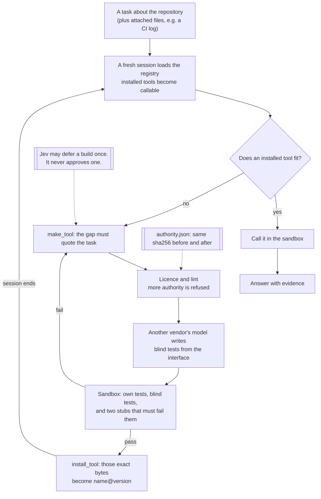

# Golem

Golem is an agent that works inside one repository. When a task needs an exact operation it does not have, it writes the tool, proves it in a sandbox, installs that exact version, and the next session uses it. Each installed tool makes the next task in that repository cheaper.

The licence does not change. `authority.json` sets what any tool may be, read, import, and spend. Golem prints its sha256 before and after every run and never writes it. Capabilities grow. Authority does not.

```bash
golem --repo PATH run "TASK" [--attach FILE ...]   # do one task
golem --repo PATH registry                         # installed tools, versions, tests, calls
golem --repo PATH rollback NAME VERSION            # point a tool back to an earlier version
golem licence                                      # the licence and its sha256
```



## How a tool gets made

The model starts with four kernel tools: `list_files` and `read_file` for the repository snapshot, `make_tool`, and `install_tool`. None of them contains domain logic. Every other tool it ever calls, it built.

1. **The gap comes from the task.** `make_tool` refuses a gap whose `task_quote` is not copied from the task text.
2. **The licence and the lint.** A tool asking for an access level, network module, subprocess, environment read, or write that the licence does not grant is refused with the reason, for example `new authority: imports urllib.request`. The lint names the request. The sandbox enforces it.
3. **Jev advises once.** `typesafe/jev-1.13`, a typed decision model on OpenRouter, answers two yes/no questions: does an installed tool already cover this, and does the task need it at all. A confident answer can defer the build once. Jev never approves an install and never picks a tool. If Jev fails, nothing changes.
4. **Blind tests.** A different model reads the interface, the task, and the repository, never the implementation, and writes `test_blind.py`. The suite is pinned to the tool's interface, so revising the code cannot make it go away.
5. **The sandbox.** `docker run --network none --read-only --cap-drop ALL --security-opt no-new-privileges --user 65534:65534` with memory, CPU, process, and time limits, no environment, and read-only mounts. Golem runs the builder's tests, the blind tests, and the same tests against two stubs: one that raises and one that returns `{}`. At least 80% of the tests must fail on both stubs, or they are vacuous.
6. **Install.** `install_tool` checks that the files still hash to what was tested, then writes `.golem/registry/NAME/VERSION/` (immutable) with the manifest, code, both test suites, and the receipt, and moves the active pointer.
7. **A fresh session.** The session ends. A new one starts from the task, a handoff note, and the registry. The installed tool is loaded from disk and called through the sandbox.

## What tools it can create

One shape: a standard-library Python function, `run(args: dict) -> dict`, with JSON schemas for input and output. It runs once per call in the sandbox and keeps no state.

| Access | It can read | Example |
| --- | --- | --- |
| Pure | Only its arguments and the task's attached files at `/inputs` | Turn a raw CI log into failing tests with file and line |
| Repository-read | Also a read-only snapshot of the repository at `/repo` | Resolve which team owns each path from `CODEOWNERS` |
| Registry-read | Also Golem's registry at `/registry`: manifests, receipts, gaps, usage, no code | Find installed tools whose outputs fit another tool's inputs |

Output is a typed result or a patch proposal as a unified diff. A tool never applies a patch. A tool never gets network access, credentials, a shell, write access, or the ability to edit the licence, its tests, or Golem.

Registry-read tools are how Golem builds its own discovery and management tooling. The kernel lists installed tools to the model; finding chains, flagging unused or failing tools, and anything smarter is left for the agent to build when a task needs it.

## Caps, enforced in code

From `authority.json`, checked by the kernel and by the SDK's stop conditions:

| Cap | Value |
| --- | --- |
| Spend per task, every model call including the blind tester and Jev | $0.20 |
| Sessions per task | 3 |
| Steps per session (`step_count_is`; the SDK itself stops at 20) | 18 |
| `make_tool` calls per task | 4 |
| Attempts per tool | 3 |
| Sandbox runs per task | 60 |
| One sandbox run | 120 s, 512 MB, 1 CPU, 128 processes |

A model call that reports no cost is charged at a deliberately high estimate, so the spend cap still binds.

## What is real, simulated, and missing

As of the night of 8 October 2026.

Real and tested: the kernel, the licence and lint, the registry with immutable versions and rollback, the repository snapshot that leaves out `.env`, keys, and `.git`, the Docker sandbox, the stub checks, blind tests and disputes, the Jev client, and the session loop. `python -m unittest discover -s tests` runs 26 tests. The sandbox tests run real containers and check that a tool sees no environment variables, runs as uid 65534, cannot open a socket, and cannot write. Three live tests call Jev on the Decisions API when `OPENROUTER_API_KEY` is set: a new log parser read as needed 0.91 and covered 0.02, and a duplicate of an installed parser as needed 0.13 and covered 0.84, which defers the build.

One real run, on a real repository: `aio-libs/aiohttp` at the commit of CI run 37533646169, with the two failing job logs attached as captured, and an empty registry. The task named no tool. Everything is in [`evidence/2026-10-08-aiohttp`](evidence/2026-10-08-aiohttp), failed attempts included.

- Golem built `parse_ci_log_failures` three times. The blind tests failed it each time, on real defects: it missed failures whose test ids carry ANSI colour codes inside them, and returned `None` for a missing file. The last failure was a blind test that expected pytest's summary line to name the test, which it never does. That run had no way to dispute a test; the dispute path was added after it. Nothing was installed.
- Golem then built `extract_aiohttp_imports` (repository-read): its own 4 tests and 7 blind tests passed, and 10 of 11 tests failed against both stubs. It was installed as 0.1.0. A fresh session loaded it from the registry and called it in the sandbox (0.19 s).
- The answer was right. The failing tests match the raw logs, and the 12 imported modules match an independent check with Python's `ast` module. The model read the logs itself for the first half, because the parser never passed.
- Spend: $0.60 of the $2.00 cap, all on one key. The licence hash was the same before and after.

What the runs exposed and what changed:

- The SDK stops a `call_model` run at 20 turns with an exception. The first try ended there with no answer. Golem now caps a session at 18 steps and ends it cleanly.
- The agent renamed a failing tool to get three more attempts. Attempts are now counted per gap, by the task words it quotes, and a rename is refused. Quoting different words of the same task still opens a new count; the task-wide cap of 4 `make_tool` calls bounds it.
- Changing a tool's interface gets a new blind suite, which can escape failing blind tests. The same caps bound it.
- The blind test writer wrote tests that create fixture files, and the lint refused them. Tests may now write; only `/tmp` is writable in the sandbox anyway.
- Builder and blind test writer both resolved to `z-ai/glm-5.3`, so the tests were blind but not independent. The receipt says `independent_tester: false`. A `tester_plugins` entry with a higher `min_coding_score` in `authority.json` would separate them.

Not yet shown: a second, different task that composes previously built tools in a fresh run, and an agent-built registry-read tool.

Simulated: `tests/test_loop.py` replaces the two model calls with fixture arguments and fixture blind tests to check the kernel loop. Those fixtures never enter a registry.

Missing: the MCP-server shape, any GitHub integration (App, Actions, pull requests, a `/golem` trigger), OAuth PKCE, and deployment. `ACTIONS.md` describes a possible Actions path; it is not used.

Fragile: Docker runs on the same machine as the process that holds the OpenRouter key. The container gets no environment, no network, no capabilities, and only read-only mounts of the bundle, the snapshot, and the attachments, but a container escape would reach the host. A remote sandbox would close that.

## Stack

Python 3.13 or later (`pyproject.toml`). The [OpenRouter Agent SDK](https://openrouter.ai/docs/agent-sdk/overview) for Python, `openrouter-agent-sdk==0.8.0`, needs `openrouter==1.1.26`: newer `openrouter` releases removed names the SDK imports. Tools run in `python:3.12-slim` under Docker and may use the standard library only.

Models come from `authority.json`, all on one OpenRouter key:

- The builder is [`openrouter/free`](https://openrouter.ai/openrouter/free), OpenRouter's router over free models. It can pick a different free model on each call; on 8 October a tool-calling test went to `nvidia/nemotron-3-ultra-550b-a55b:free` and then `apodex/apodex-1.1-mini:free`, at $0. The earlier runs in `evidence/` used `openrouter/pareto-code` at its Low tier (`min_coding_score` 0.25), which resolved to `z-ai/glm-5.3`.
- The blind test writer is [`openrouter/pareto-code`](https://openrouter.ai/openrouter/pareto-code) at the Low tier, `z-ai/glm-5.3` on 8 October, so it is a different model from the builder. Every receipt records which models served the builder and the tester, and marks `independent_tester: false` if they were the same. In the earlier runs both sides resolved to `z-ai/glm-5.3`, and their receipts say so.
- Jev is `typesafe/jev-1.13`, called on OpenRouter's [Decisions API](https://openrouter.ai/docs/client-sdks/python/sdks/decisions/README) (`POST /api/alpha/decisions`). A call costs about $0.00002. The receipt keeps the dated snapshot, for example `typesafe/jev-1.13-20260917`.
